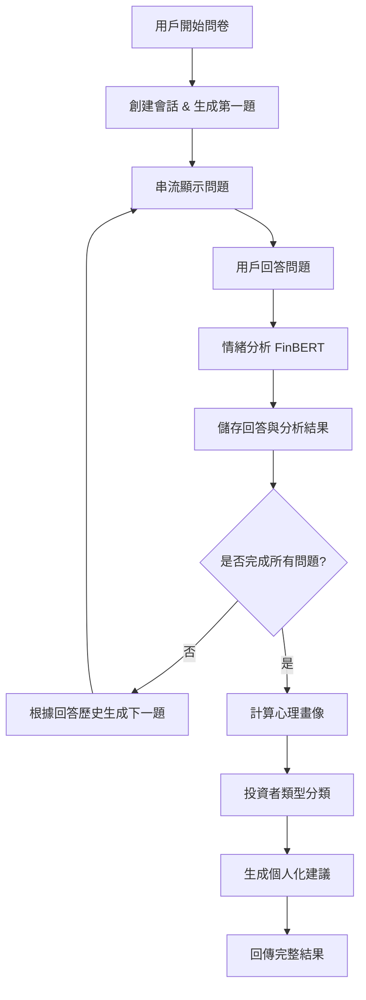

# 投資心理問卷 API 系統

基於 FastAPI 的智能投資心理分析系統，結合 Google Gemini AI 和 FinBERT 情緒分析模型，為用戶提供個人化的投資心理評估和建議。採用現代化模組化架構設計。

## 📁 專案架構

```
psychology/
├── app/
│   ├── config.py                  # 應用程式配置
│   ├── main.py                    # 主應用程式入口
│   ├── models/                    # 機器學習模型
│   │   ├── __init__.py
│   │   ├── SentimentModel.py      # FinBERT 情緒分析模型
│   │   └── StressModel.py         # 壓力分析模型（已停用）
│   ├── routers/                   # API 路由
│   │   └── questionnaire.py       # 問卷相關端點
│   ├── schemas/                   # Pydantic 資料模型
│   │   └── questionnaire.py       # 問卷 API 的請求/回應模型
│   ├── services/                  # 業務邏輯服務
│   │   ├── __init__.py
│   │   ├── analysis_service.py    # 心理分析與投資者分類服務
│   │   ├── gemini_service.py      # AI 問題生成與建議服務
│   │   └── questionnaire_service.py # 問卷會話管理服務
│   └── utils/                     # 工具類
│       ├── test.py
│       └── Translate.py           # 中英翻譯工具
├── test/                          # 測試檔案
│   ├── main.py.bak
│   └── runmodel.py
├── .env                           # 環境變數（需自行建立）
├── .env.example                   # 環境變數範例
├── .gitignore
├── requirements.txt               # 依賴套件
└── README.md                      # 專案說明
```

## 🎯 功能特色

- 🤖 **動態問題生成**：使用 Gemini AI 根據用戶回答動態生成個人化問題
- 📊 **多種題型支援**：支援選擇題、Likert 量表、開放式問題
- 🧠 **情緒分析**：使用 FinBERT 模型分析投資相關情緒（正面/負面/中性）
- 💼 **投資者分類**：基於心理特徵將用戶分類為五種投資者類型
- 🎭 **心理畫像**：生成風險偏好、穩定性、信心、耐心、敏感度等五維度評分
- 🏗️ **模組化架構**：清晰的職責分工，易於維護和擴展

## 🔄 系統亮點

### 1. 智能問卷設計

- **動態問題生成**: 使用 Gemini AI 根據用戶回答歷史生成個人化問題
- **題型輪替機制**: 自動輪替情緒反應、壓力感知、風險偏好、決策習慣四種題型
- **格式自動識別**: 前端可自動識別選擇題、Likert 量表、開放式問題

### 2. 投資心理分析

- **五維度評估**: 風險偏好、穩定性、信心、耐心、敏感度（0-100 分）
- **投資者分類**: 波動型、探險型、冷靜型、謹慎型、綜合型五種類型
- **情緒分析**: 使用 FinBERT 金融領域專用模型分析投資情緒

### 3. 服務分層架構

#### 📊 AnalysisService

- 情緒分析與心理畫像計算
- 投資者類型分類演算法
- 支援上下文分析（問題+回答）

#### 🤖 GeminiService

- 動態問題生成與串流顯示
- 個人化建議生成
- 支援 fallback 機制確保服務穩定性

#### 📝 QuestionnaireService

- 會話狀態管理與進度追蹤
- 問答資料儲存與檢索
- 多用戶並發支援

## 🛠️ 技術架構

### 後端技術

- **FastAPI**: 高性能 Python Web 框架，支援自動 API 文檔生成
- **Google Generative AI**: Gemini-2.0-flash 模型用於問題生成和建議
- **Transformers**: HuggingFace 模型庫，支援 GPU 加速
- **Pydantic**: 資料驗證和設定管理
- **Python-dotenv**: 環境變數管理

### AI 模型

- **情緒分析**: ProsusAI/finbert（金融領域專用情緒分析模型）
- **問題生成**: Google Gemini-2.0-flash（支援繁體中文）
- **翻譯服務**: Google Translate API（透過 utils/Translate.py）
- **設備支援**: 自動檢測 GPU 並使用 CUDA 加速（device=0）

## 🚀 安裝與啟動

### 環境需求

- Python 3.8+
- CUDA（推薦，用於 GPU 加速模型推理）
- Google API Key（用於 Gemini AI 服務）

### 安裝步驟

```bash
# 1. 克隆專案
git clone <repository-url>
cd psychology

# 2. 安裝依賴
pip install -r requirements.txt

# 3. 設置環境變數
# 複製範例檔案並編輯
cp .env.example .env
# 編輯 .env 檔案，加入你的 Google API Key
echo "GOOGLE_API_KEY = your_gemini_api_key_here" > .env
```

### 啟動服務

```bash
# 開發模式（自動重載）
cd app
uvicorn main:app --reload --host 0.0.0.0 --port 8081
```

## 📚 API 文檔

### 基本資訊

- **基礎 URL**: `http://localhost:8081`
- **API 文檔**: `http://localhost:8081/docs`（Swagger UI）
- **ReDoc 文檔**: `http://localhost:8081/redoc`

### 主要端點

#### 1. 開始問卷

```http
POST /questionnaire/start
```

**回應**:

```json
{
  "session_id": "uuid-string",
  "question": "當股市短期暴跌 10% 時，您通常會怎麼做？ 冷靜觀望 / 想立刻賣出 / 加碼買進",
  "question_number": 1,
  "total_questions": 4
}
```

#### 2. 提交回答

```http
POST /questionnaire/answer
```

**請求體**:

```json
{
  "session_id": "uuid-string",
  "answer": "冷靜觀望"
}
```

**回應**（還有下一題）:

```json
{
  "has_next_question": true,
  "question": "在投資時，您多久會感到焦慮？請以 1 到 5 評分（1=從不，5=非常常）",
  "question_number": 2,
  "total_questions": 4
}
```

**回應**（問卷完成）:

```json
{
  "has_next_question": false,
  "advice": "根據您的投資心理分析...",
  "profile": {
    "risk": 65,
    "stability": 72,
    "confidence": 58,
    "patience": 80,
    "sensitivity": 45
  },
  "investor_type": "冷靜型（理性決策）"
}
```

#### 3. 串流顯示問題

```http
POST /questionnaire/stream-question
```

**請求體**:

```json
{
  "session_id": "uuid-string"
}
```

**回應**: Server-Sent Events 串流格式

#### 4. 其他端點

- `POST /questionnaire/save-question` - 儲存問題回答
- `GET /health` - 健康檢查
- `GET /` - 服務資訊

## 🔄 系統流程



## 🎯 投資者類型分類

系統會根據用戶的心理畫像自動分類為以下五種投資者類型：

- **波動型**：情緒受市場影響，風險偏好高但穩定性低
- **探險型**：高風險偏好且心理穩定，敢於嘗試新投資
- **冷靜型**：理性決策，風險偏好低但穩定性高
- **謹慎型**：保守穩健，風險偏好和穩定性都較低
- **綜合型**：各項指標平衡，投資風格中庸

## 📊 心理畫像維度

系統會為每位用戶生成五個維度的評分（0-100 分）：

- **風險偏好**：對投資風險的接受程度
- **穩定性**：面對市場波動時的心理穩定度
- **信心**：對自己投資決策的信心程度
- **耐心**：長期持有投資的耐心程度
- **敏感度**：對市場變化的敏感反應程度

## ⚙️ 配置說明

### 問卷配置（config.py）

- **總問題數**: `TOTAL_QUESTIONS = 4`（可調整）
- **題型輪替**: 情緒反應 → 壓力感知 → 風險偏好 → 決策習慣
- **串流延遲**: `STREAM_DELAY = 0.03`（字元間隔時間）

### Gemini AI 配置

- **模型**: `gemini-2.0-flash`
- **問題生成溫度**: `0.8`（控制創造性）
- **建議生成溫度**: `0.7`（控制建議品質）
- **最大輸出**: 問題 150 tokens，建議 1024 tokens

### 分析模型配置

- **情緒分析**: ProsusAI/finbert（金融領域專用）
- **上下文分析**: 支援問題+回答聯合分析
- **設備支援**: 自動檢測並使用 GPU 加速（device=0）
- **翻譯服務**: 中文自動翻譯為英文進行分析

## 🛠️ 開發與測試

### API 測試

```bash
# 測試健康檢查
curl http://localhost:8000/health

# 開始問卷
curl -X POST "http://localhost:8000/questionnaire/start" \
     -H "Content-Type: application/json"

# 提交回答
curl -X POST "http://localhost:8000/questionnaire/answer" \
     -H "Content-Type: application/json" \
     -d '{"session_id":"your-session-id","answer":"冷靜觀望"}'

# 查看 API 文檔
# 瀏覽器開啟: http://localhost:8000/docs
```

## 📝 開發建議

1. **單元測試**: 為各服務模組編寫測試案例
2. **資料庫整合**: 將會話資料持久化（Redis/PostgreSQL）
3. **前端整合**: 開發 React/Vue 前端介面
4. **監控系統**: 添加 API 監控和效能追蹤
5. **快取機制**: 實作模型預測結果快取
6. **API 限流**: 防止 Gemini API 配額濫用
7. **日誌系統**: 完善錯誤處理和日誌記錄

## ❓ 常見問題

### Q: 模型載入時間很長？

A: 首次載入需要下載 FinBERT 模型檔案（約 400MB），建議使用 GPU 加速。載入成功會顯示「✅ 分析模型載入成功」。

### Q: Gemini API 調用失敗？

A: 檢查 `.env` 檔案中的 `GOOGLE_API_KEY` 是否正確設定。沒有 API Key 時會使用 fallback 問題。

### Q: 如何調整問卷題數？

A: 修改 `config.py` 中的 `TOTAL_QUESTIONS` 參數即可。

### Q: 投資者分類演算法？

A: 基於風險偏好和穩定性兩個主要維度，結合其他心理特徵進行分類。
