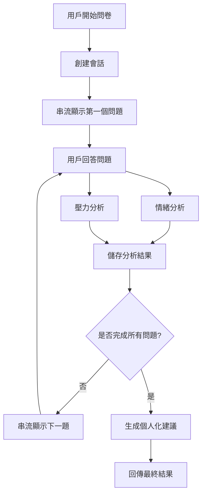

# 心理問卷 API 系統

一個基於 FastAPI 的智能心理分析系統，結合 Google Gemini AI 和機器學習模型，為用戶提供個人化的心理健康建議。用現代化的模組化架構。

## 📁 專案架構

```
psychology/
├── app/
│   ├── __init__.py
|   ├── config.py                  # 應用程式配置
│   ├── main.py                    # 主應用程式入口
│   ├── models/                    # 機器學習模型
│   │   ├── SentimentModel.py      # 情緒分析模型
│   │   └── StressModel.py         # 壓力分析模型
│   ├── routers/                   # API 路由
│   │   ├── __init__.py
│   │   └── questionnaire.py       # 問卷相關端點
│   ├── schemas/                   # Pydantic 資料模型
│   │   ├── __init__.py
│   │   └── questionnaire.py       # 問卷 API 的請求/回應模型
│   ├── services/                  # 業務邏輯服務
│   │   ├── __init__.py
│   │   ├── analysis_service.py    # 心理分析服務
│   │   ├── gemini_service.py      # AI 內容生成服務
│   │   └── questionnaire_service.py # 問卷管理服務
│   └── utils/                     # 工具類
│       └── Translate.py           # 翻譯工具
├── requirements.txt               # 依賴套件
└── README.md                      # 專案說明
```

## 功能特色

- 🤖 **字符級串流顯示**：問題逐字顯示，提供流暢的用戶體驗
- 🧠 **情緒分析**：使用 FinBERT 模型分析用戶的心理情緒（正面/負面/中性）
- 😰 **壓力檢測**：使用 RoBERTa 模型檢測用戶的壓力水平
- 📊 **個人化建議**：基於情緒和壓力分析結果提供量身定制的心理健康建議
- 🌐 **多語言支持**：支援中文輸入，自動翻譯後進行英文模型分析
- 🔄 **會話管理**：支持多用戶同時使用，安全的會話隔離
- 🏗️ **模組化架構**：清晰的職責分工，易於維護和擴展

## 🔄 系統亮點

### 1. 模組化設計
- **路由分離**: 使用 `APIRouter` 將端點按功能分組
- **業務邏輯分離**: 將核心邏輯移至 `services/` 資料夾
- **資料模型分離**: 將 Pydantic 模型移至 `schemas/` 資料夾
- **清晰的職責分工**: 每個模組都有明確的單一職責

### 2. 服務分層架構

#### 📊 AnalysisService
- 負責情緒和壓力分析
- 管理 ML 模型的載入和調用
- 提供統一的分析介面

#### 🤖 GeminiService  
- 處理 AI 內容生成
- 管理 Google Gemini API 調用
- 提供串流和標準生成模式

#### 📝 QuestionnaireService
- 管理問卷會話狀態
- 處理問題順序和進度
- 提供會話生命週期管理

## 技術架構

### 後端技術
- **FastAPI**: 高性能 Python Web 框架
- **Google Generative AI**: Gemini-2.0-flash 模型用於問題生成和建議
- **Transformers**: HuggingFace 模型庫
- **Pydantic**: 數據驗證和設置管理

### AI 模型
- **情緒分析**: ProsusAI/finbert (金融領域情緒分析)
- **壓力檢測**: roberta-base_stress_classification
- **問題生成**: Google Gemini-2.0-flash
- **翻譯**: Google Translate (透過 utils/Translate.py)

## 🚀 安裝與啟動

### 環境需求
```bash
Python 3.8+
CUDA (推薦，用於加速模型推理)
```

### 安裝步驟
```bash
# 1. 克隆專案
git clone <repository-url>
cd psychology

# 2. 安裝依賴
pip install -r requirements.txt

# 3. 設置環境變數
# 創建 .env 文件並添加：
echo "GOOGLE_API_KEY=your_gemini_api_key_here" > .env
```

### 啟動服務

#### 使用 uvicorn 命令 (推薦)
```bash
# 開發模式 (自動重載)
uvicorn main:app --reload --host 0.0.0.0 --port 8000

# 生產模式
uvicorn main:app --host 0.0.0.0 --port 8000
```

## 📚 API 文檔

### 基本信息
- **基礎 URL**: `http://localhost:8000`
- **API 文檔**: `http://localhost:8000/docs` (Swagger UI)
- **ReDoc 文檔**: `http://localhost:8000/redoc`

### API 端點

所有問卷相關端點現在都有統一前綴：`/questionnaire/`

#### 1. 開始問卷
```http
POST /questionnaire/start
```

**回應**:
```json
{
  "session_id": "uuid-string",
  "question": "最近在工作或學習上，有哪些情況讓你感到最大的壓力？",
  "question_number": 1,
  "total_questions": 3
}
```

#### 2. 串流顯示問題
```http
POST /questionnaire/stream-question
```

**請求體**:
```json
{
  "session_id": "uuid-string"
}
```

**回應**: Server-Sent Events 串流格式

#### 3. 提交回答
```http
POST /questionnaire/answer
```

**請求體**:
```json
{
  "session_id": "uuid-string",
  "answer": "工作壓力主要來自截止日期和績效要求"
}
```

**回應** (還有下一題):
```json
{
  "has_next_question": true,
  "question": "當面對困難的時候，你通常會採用什麼方式來處理？",
  "question_number": 2,
  "total_questions": 3
}
```

**回應** (問卷完成):
```json
{
  "has_next_question": false,
  "advice": "根據您的分析結果，建議您建立規律的壓力管理習慣..."
}
```

#### 4. 儲存問題回答
```http
POST /questionnaire/save-question
```

#### 5. 健康檢查
```http
GET /health
```

**回應**:
```json
{
  "status": "healthy",
  "service": "psychology-questionnaire-api"
}
```

## 🔄 系統流程



## ✨ 重構優勢

1. **可維護性提升**: 清晰的模組分工，易於理解和修改
2. **可測試性增強**: 每個服務都可以獨立測試
3. **可擴展性**: 新功能可以輕鬆添加新的路由和服務
4. **程式碼復用**: 服務層可以被多個路由重複使用
5. **關注點分離**: UI 邏輯、業務邏輯、資料存取各司其職

## 🔧 主要重構變更

### main.py
- 簡化為純應用程式入口
- 移除所有業務邏輯程式碼
- 專注於中介軟體和路由註冊

### 新增檔案
- `schemas/questionnaire.py`: API 資料模型
- `services/analysis_service.py`: 分析功能
- `services/gemini_service.py`: AI 生成功能  
- `services/questionnaire_service.py`: 問卷管理
- `routers/questionnaire.py`: 問卷 API 端點

### 相對導入修正
所有檔案都使用正確的相對導入路徑，確保模組間的依賴關係清晰。

## ⚙️ 配置說明

### 問卷配置
- **總問題數**: 可在 `config.py` 中調整
- **問題內容**: 聚焦於心理健康和壓力管理
- **會話管理**: 支援多用戶並發使用

### AI 模型配置
- **Gemini 模型**: gemini-2.0-flash
- **溫度參數**: 0.7 (控制回答創造性)
- **最大輸出**: 1024 tokens
- **串流顯示**: 字符級別的逐字顯示

### 分析模型
- **情緒分析**: FinBERT 模型，支援金融/心理情緒分析
- **壓力檢測**: RoBERTa 模型，專門用於壓力水平檢測
- **設備支援**: 自動檢測並使用 GPU 加速 (device=0)

## 🛠️ 開發與測試

### 本地開發
```bash
# 啟動開發伺服器 (自動重載)
uvicorn app.main:app --reload --host 0.0.0.0 --port 8000

# 或者僅本地訪問
uvicorn app.main:app --reload
```

### API 測試
```bash
# 測試健康檢查
curl http://localhost:8000/health

# 開始問卷
curl -X POST "http://localhost:8000/questionnaire/start" \
     -H "Content-Type: application/json"

# 查看 API 文檔
# 瀏覽器打開: http://localhost:8000/docs
```

### 單元測試 (建議實作)
```bash
# 測試分析服務
python -m pytest tests/test_analysis_service.py

# 測試問卷服務  
python -m pytest tests/test_questionnaire_service.py

# 測試 API 端點
python -m pytest tests/test_routes.py
```

## 📝 後續建議

1. **單元測試**: 為每個服務編寫單元測試
2. **文件化**: 為 API 端點添加詳細的文件註解
3. **錯誤處理**: 增強錯誤處理和日誌記錄
4. **配置管理**: 將配置項目抽象到專門的配置檔案
5. **資料庫整合**: 考慮將會話資料持久化到資料庫
6. **前端整合**: 開發配套的 React/Vue 前端介面
7. **監控系統**: 添加系統監控和性能追蹤

## 🚀 部署建議
```

### 生產環境
```bash
# 使用 Gunicorn + Uvicorn
pip install gunicorn
gunicorn main:app -w 4 -k uvicorn.workers.UvicornWorker
```

## ❓ 常見問題

### Q: 模型加載時間很長？
A: 首次加載需要下載模型文件，建議使用 GPU 加速。

### Q: Gemini API 調用失敗？
A: 檢查 `.env` 文件中的 `GOOGLE_API_KEY` 是否正確設置。

### Q: 中文分析準確度？
A: 系統會自動將中文翻譯成英文後進行分析，確保模型準確性。

### Q: 串流顯示速度調整？
A: 在 `GeminiService.stream_question_generation` 中調整 `asyncio.sleep` 時間。
---

**最後更新**: 2025年10月26日  
**架構版本**: v2.0 (模組化重構版)
