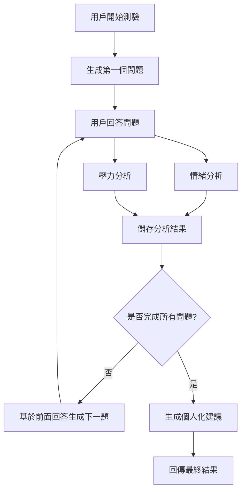

# 心理投資問卷系統

一個基於 FastAPI 的智能投資心理分析系統，結合 Google Gemini AI 和機器學習模型，為用戶提供個人化的投資建議。

## 功能特色

- 🤖 **動態問題生成**：使用 Google Gemini AI 根據用戶回答動態生成個人化問題
- 🧠 **情緒分析**：使用 FinBERT 模型分析用戶的投資情緒（正面/負面/中性）
- 😰 **壓力檢測**：使用 RoBERTa 模型檢測用戶的投資壓力水平
- 📊 **個人化建議**：基於情緒和壓力分析結果提供量身定制的投資建議
- 🌐 **多語言支持**：支援中文輸入，自動翻譯後進行英文模型分析
- 🔄 **會話管理**：支持多用戶同時使用，安全的會話隔離

## 技術架構

### 後端技術
- **FastAPI**: 高性能 Python Web 框架
- **Google Generative AI**: Gemini-2.5-flash 模型用於問題生成和建議
- **Transformers**: HuggingFace 模型庫
- **Pydantic**: 數據驗證和設置管理

### AI 模型
- **情緒分析**: ProsusAI/finbert (金融領域情緒分析)
- **壓力檢測**: roberta-base_stress_classification
- **問題生成**: Google Gemini-2.0-flash(建議)
               Google Gemini-2.0-flash-exp (不要使用gemini-2.5系列，高機率會有安全過濾阻斷回復)
- **翻譯**: Google Translate (透過 utils/Translate.py)

## 安裝與設置

### 1. 環境需求
```bash
Python 3.8+
CUDA (推薦，用於加速模型推理)
```

### 2. 安裝依賴
```bash
pip install -r requirements.txt
```

### 3. 環境變數設置
創建 `.env` 文件並添加：
```bash
GOOGLE_API_KEY=your_gemini_api_key_here
```

### 4. 啟動服務
```bash
# 開發模式
uvicorn main:app --reload --host 0.0.0.0 --port 8000

# 生產模式
uvicorn main:app --host 0.0.0.0 --port 8000
```

## API 文檔

### 基本信息
- **基礎 URL**: `http://localhost:8000`
- **API 文檔**: `http://localhost:8000/docs`
- **重定向文檔**: `http://localhost:8000/redoc`

### 主要端點

#### 1. 開始測驗
```http
POST /start
```

**回應**:
```json
{
  "session_id": "uuid-string",
  "question": "請簡單描述您的投資經驗？"
}
```

#### 2. 提交回答
```http
POST /answer
```

**請求體**:
```json
{
  "session_id": "uuid-string",
  "answer_text": "我是投資新手，主要投資基金"
}
```

**回應**:
```json
{
  "next_question": "面對投資虧損時您會如何反應？",
  "finished": false,
  "advice": null
}
```

**完成時回應**:
```json
{
  "next_question": null,
  "finished": true,
  "advice": "根據您的分析結果，建議採用保守投資策略..."
}
```

#### 3. 系統狀態
```http
GET /models
```

**回應**:
```json
{
  "model_name": "gemini-2.5-flash",
  "api_key_set": true,
  "total_questions": 5
}
```

## 系統流程



## 文件結構

```
psychology/
├── main.py                 # FastAPI 主應用程式
├── SentimentModel.py       # 情緒分析模型
├── StressModel.py          # 壓力檢測模型
├── requirements.txt        # 依賴列表
├── .env                    # 環境變數 (需自行創建)
├── README.md              # 說明文檔
└── utils/
    ├── Translate.py       # 翻譯工具
    └── test.py           # 測試腳本
```

## 配置說明

### 模型配置
- **總問題數**: 5 題 (可在 `main.py` 中調整 `TOTAL_QUESTIONS`)
- **Gemini 模型**: gemini-2.0-flash 或 gemini-2.0-flash-exp
- **溫度參數**: 0.7 (控制回答創造性)
- **最大輸出**: 1024 tokens

### 問題生成邏輯
1. **第一題**: 基於預設提示生成基礎問題
2. **後續題目**: 根據用戶之前的回答動態生成
3. **長度控制**: 每個問題 15-25 字
4. **重複避免**: AI 會避免生成相似問題

## 錯誤處理

系統包含完整的錯誤處理機制：

- **API 配額用完**: 顯示相應錯誤訊息
- **API 金鑰權限不足**: 提示檢查設定
- **模型載入失敗**: 使用備用回應
- **網絡連接問題**: 自動重試機制

## 開發與測試

### 本地測試
```bash
# 測試 API 端點
curl -X POST "http://localhost:8000/start"

# 檢查系統狀態
curl "http://localhost:8000/models"
```

### 添加新功能
1. 修改相應的模型文件
2. 更新 API 端點
3. 更新文檔和測試

## 部署建議

### Docker 部署(可選，其實沒必要)
```dockerfile
FROM python:3.9-slim
WORKDIR /app
COPY requirements.txt .
RUN pip install -r requirements.txt
COPY . .
EXPOSE 8000
CMD ["uvicorn", "main:app", "--host", "0.0.0.0", "--port", "8000"]
```

### 生產環境配置
- 使用 Gunicorn + Uvicorn workers
- 設置適當的 CORS 限制
- 添加速率限制
- 設置日誌記錄
- 使用 HTTPS

## 常見問題

### Q: 模型加載時間很長？
A: 首次加載需要下載模型文件，建議使用 GPU 加速。

### Q: Gemini API 調用失敗？
A: 檢查 API 金鑰是否正確設置，以及是否有足夠的配額。

### Q: 中文分析準確度？
A: 系統會自動將中文翻譯成英文後進行分析，確保模型準確性。

### Q: 如何自定義問題數量？
A: 修改 `main.py` 中的 `TOTAL_QUESTIONS` 變數。
---
